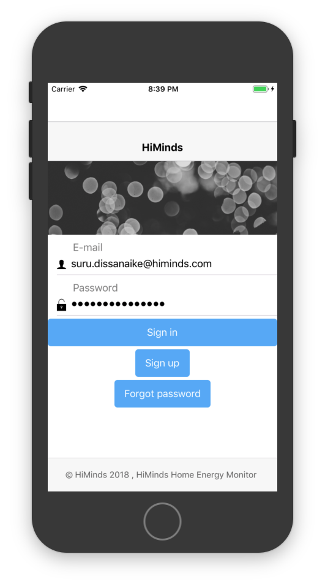
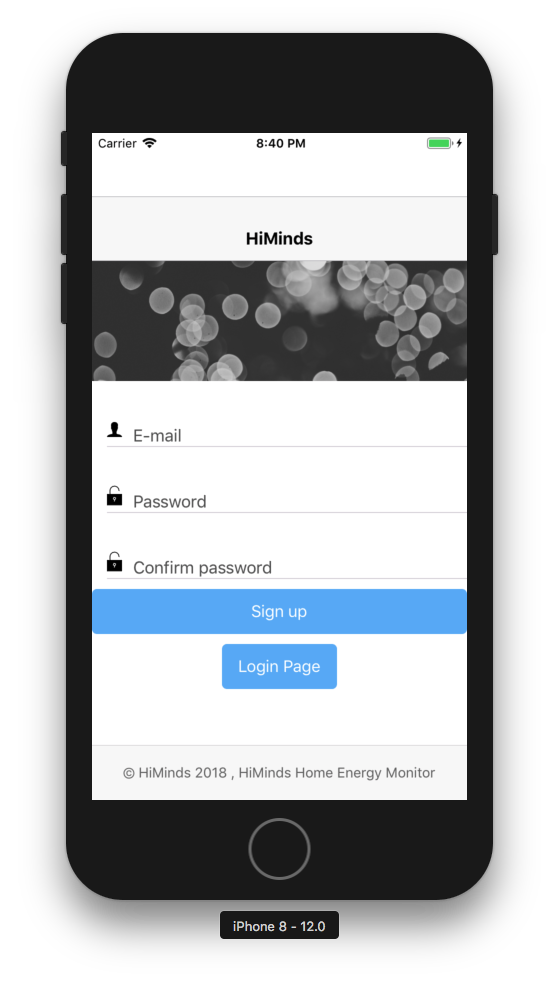
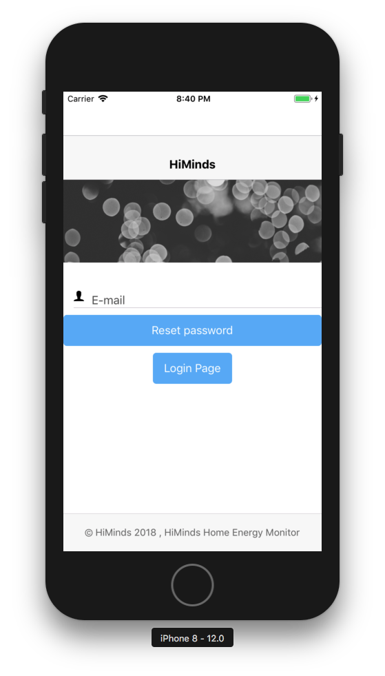
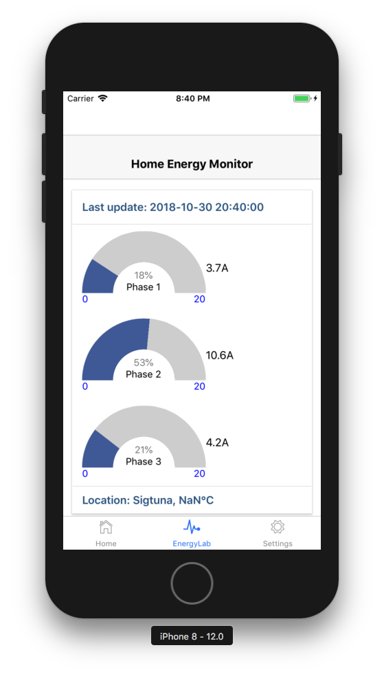
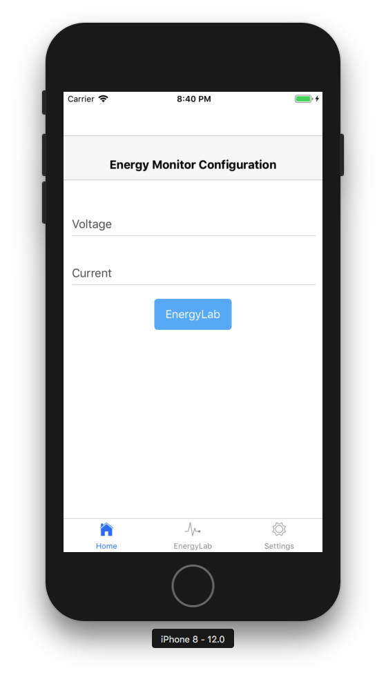
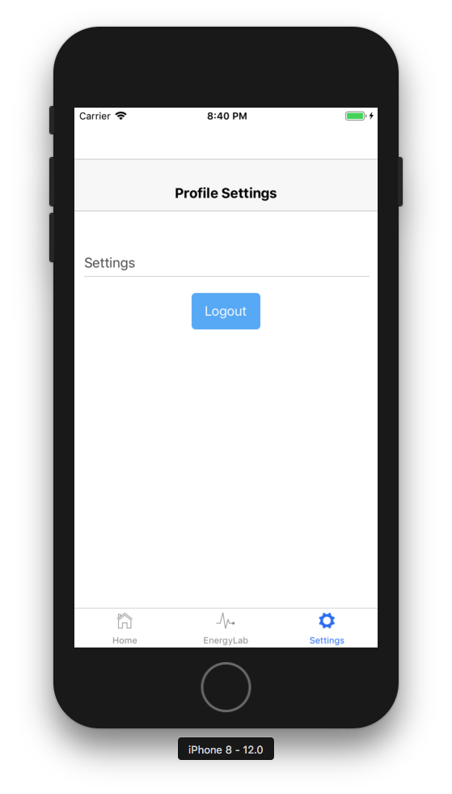

# himinds-iot-project-mobile-home-energy-monitor-app

## Overview

The Single-Phase Voltage in Sweden is 230 V and the Three-Phase Voltage is 400 V. The Frequency is 50 Hz. Our React Native app works both in iOS and Android, it display the current power consumption on the three different phases i.e. L1, L2, L3.

This app is a template app that we use in our [himinds-iot-project](https://github.com/HiMinds/himinds-iot-project-overview).

## Technology stack:

* [React Native](https://facebook.github.io/react-native/)
* [Expo](https://expo.io/)
* [Firebase](https://firebase.google.com/)
* [NativeBase](https://nativebase.io/)
* [React Navigation] (https://reactnavigation.org/)
* [React Native Speedometer Chart] (https://github.com/LucasMonteiro1/react-native-speedometer-chart)

## Learning resources:

* [Facebook React Native](https://facebook.github.io/react-native/docs/getting-started.html)
* [React Native Express] (http://www.reactnativeexpress.com/)
* [Expo.io docs](https://docs.expo.io/versions/latest/)
* [Expo Blog](https://blog.expo.io/)


## prerequisites:
We use Firebase database and authentication in the App. You need to create an account; follow this tutorial: [Add Firebase to your JavaScript Project](https://firebase.google.com/docs/web/setup)

You need to copy your web setup to the APIKey.js file.

```

<script src="https://www.gstatic.com/firebasejs/5.5.6/firebase.js"></script>
<script>
  // Initialize Firebase
  // TODO: Replace with your project's customized code snippet
  var config = {
    apiKey: "<API_KEY>",
    authDomain: "<PROJECT_ID>.firebaseapp.com",
    databaseURL: "https://<DATABASE_NAME>.firebaseio.com",
    projectId: "<PROJECT_ID>",
    storageBucket: "<BUCKET>.appspot.com",
    messagingSenderId: "<SENDER_ID>",
  };
  firebase.initializeApp(config);
</script>

```

Install expo-cli:
```
npm install expo-cli --global
```

## Installation:
```
npm install

```

## Usage:
```
expo start
```


## Screens:

### Login screen



### Sign up



### Forgot password



### Home Energy Monitor
Main screen, uses the React Native Speedometer Chart component to draw a dashboard.
Updates are triggered by inserting new data into Cloud Firestore.



### Home
Just a placeholder screen.



### Profile Settings
Just a placeholder screen but you can log out if you want...


